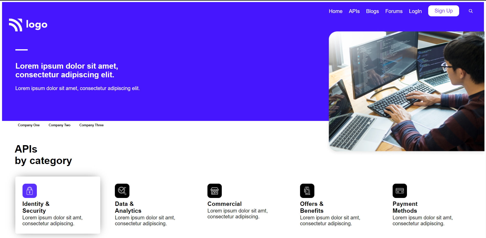

# Project 9 - Developers Landing Page

## Hi there, I am `Akshay Barapatre` Aspiring FullStack Javascript Developer   

---

## Short View of Website

---

 
## Project 9 [Live Link](https://developr-landing-home-page.netlify.app/)

-   Skills Gained in this project
    -   Learned various flexbox properties used for navbar like flex-wrap .
    -  Hover effect on card 
    -  How to align things for Mobile Responsive sites like Height, Width
    -   Learned about rem important for Mobile responsive sites

---

## Time taken to finish this project

-   6 hour taken to complete it.

